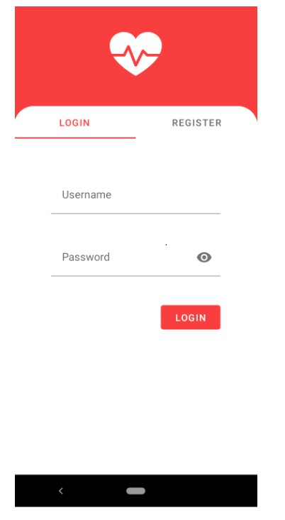
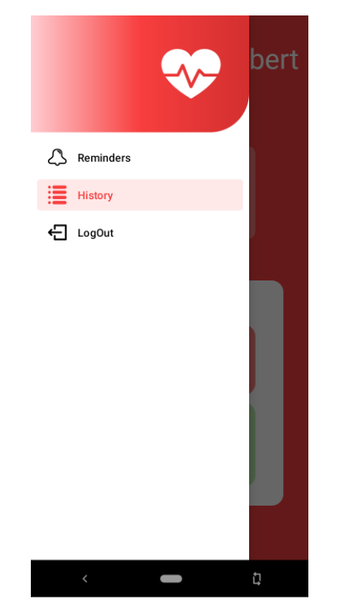
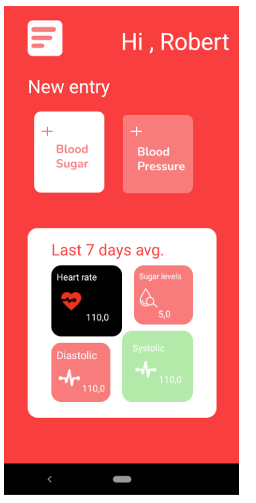
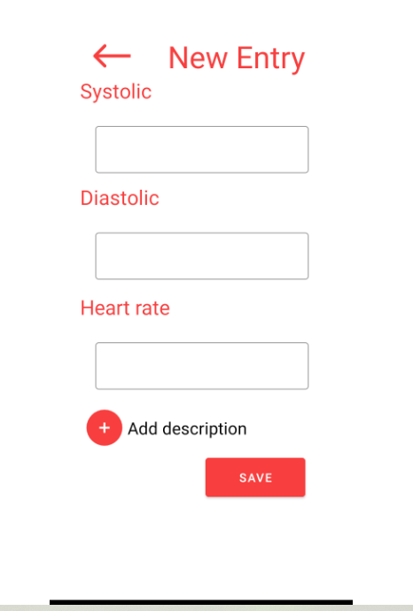
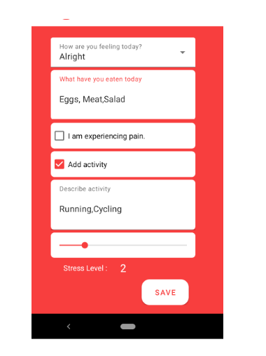
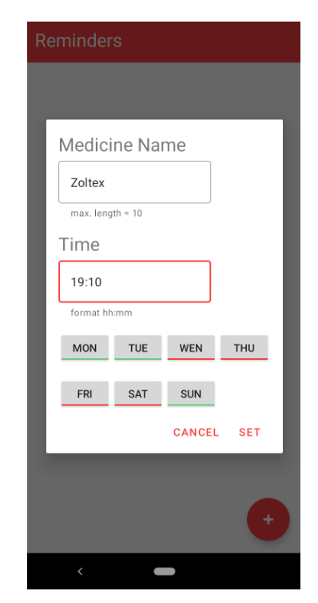

<!DOCTYPE html>
<html lang="en">
<head>
  <meta charset="UTF-8">
  <meta name="viewport" content="width=device-width, initial-scale=1">
  <title>Pressure-Tracker</title>
  
</head>
<body>
  <h1>Pressure-Tracker</h1>
  

    Pressure-Tracker is a sleek, intuitive application designed to help anyone track their blood pressure and overall health statistics. Whether you're monitoring your condition or simply keeping an eye on your wellness, this app provides an effortless way to log, review, and manage your health data.
  

  <h2>Features</h2>
  <ul>
    <li><strong>Secure Login:</strong> Safely access your personal health data.</li>
    <li><strong>Intuitive Navigation:</strong> Seamlessly switch between app sections with an easy-to-use sidebar.</li>
    <li><strong>Comprehensive Dashboard:</strong> Get an instant overview of your recent readings and health trends.</li>
    <li><strong>User Data Management:</strong> Review and update your historical health records effortlessly.</li>
    <li><strong>New Entry Form:</strong> Log new blood pressure readings quickly and accurately.</li>
    <li><strong>Reminder System:</strong> Set up notifications to ensure you never miss a measurement.</li>
  </ul>

  

  <h2>Screenshots</h2>
  <figure>
    
    <figcaption>Login Screen – Secure user authentication interface.</figcaption>
  </figure>
  
  <figure>
    
    <figcaption>Side Navigation – Quick access to all app features.</figcaption>
  </figure>
  
  <figure>
    
    <figcaption>Dashboard – Overview of your recent blood pressure readings and stats.</figcaption>
  </figure>
  
  <figure>
    
    <figcaption>User Data – Manage and review your historical health records.</figcaption>
  </figure>
  
  <figure>
    
    <figcaption>New Entry Form – Easily log new blood pressure readings.</figcaption>
  </figure>
  
  <figure>
    
    <figcaption>Detailed Entry Inputs – Ensure accurate data recording.</figcaption>
  </figure>
  
  <figure>
    
    <figcaption>Reminder Setup – Configure notifications to keep your tracking on schedule.</figcaption>
  </figure>
  
  <figure>
    
    <figcaption>Reminder Notification – Timely alerts for your health measurements.</figcaption>
  </figure>

  

  <h2>Getting Started</h2>
  

    To start using Pressure-Tracker, follow these steps:
  

  <pre>
git clone https://github.com/yourusername/Pressure-Tracker.git
cd Pressure-Tracker
npm install
npm start
  </pre>
  

    The application will launch on your local development server, and you'll be ready to track your health data in no time.
  

  <h2>Contributing</h2>
  

    Contributions are welcome! If you have any suggestions, improvements, or bug fixes, please open an issue or submit a pull request.
  

  <h2>License</h2>
  

    This project is licensed under the <strong>MIT License</strong>.
  

</body>
</html>
